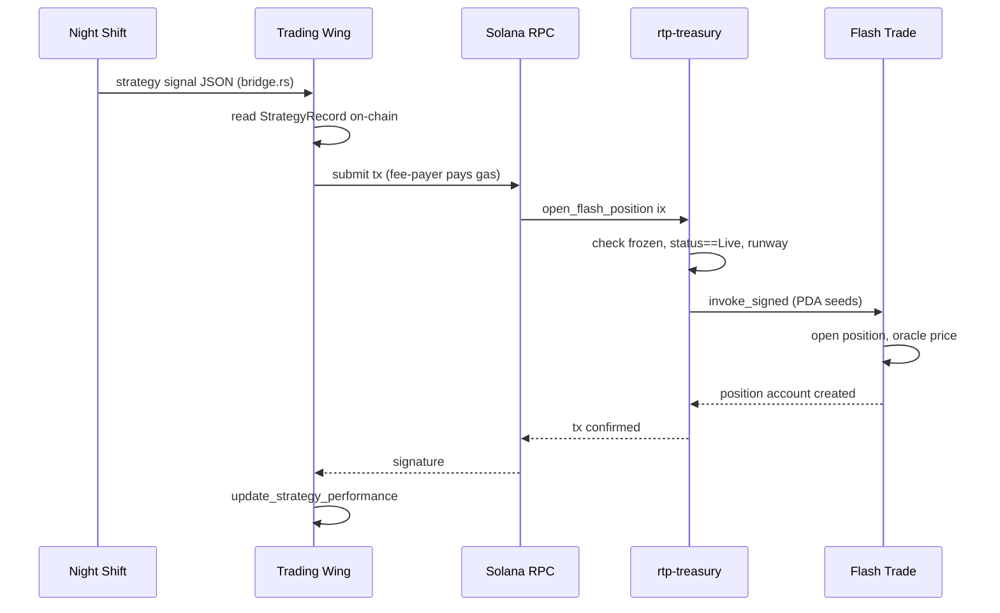

# Flash Trade PDA Integration Spec
## Branch: `feat/flashtrade-pda-execution`

**Status:** Revised  
**Author:** RTP Brain Partner  
**Date:** 2026-04-27  
**Repo:** [tradewife/resilient-token-protocol](https://github.com/tradewife/resilient-token-protocol)  
**Touches:** `rtp/programs/rtp-treasury/` (Anchor program), `rtp/swarm/` (agent layer)

---

## 1. Problem Statement

The current execution path routes trading decisions through Hyperliquid (cross-chain perps DEX) via a combination of an ETH keypair for EIP-712 order signing and the Phantom MCP server for SOL↔USDC bridging. This introduces three structural problems:

1. **Trust liability** — The ETH keypair (`configs/hl_testnet_key.json`) and Phantom MCP session are centralised points of failure. Compromise of either is equivalent to a rug. "Don't rug" is currently an assertion, not a program invariant.
2. **Verifiability gap** — Judging-day claim: "all agent actions are auditable on-chain." Reality: trade authorisation happens off-chain (EIP-712 signed in Rust, executed on HL testnet/mainnet), not on-chain on Solana.
3. **Custody mismatch** — Treasury funds must leave the Solana PDA to reach Hyperliquid. The PDA's 90-day runway invariant (`min_runway_balance`) cannot be enforced during the Hyperliquid leg.

This upgrade replaces the Hyperliquid/Phantom execution path with a **PDA-signed CPI into Flash Trade's on-chain Solana program**, eliminating the human keypair and cross-chain bridge entirely from the trading execution loop. Everything stays on Solana.

---

## 2. Target Architecture

### 2.1 Current State

```
Python Research Layer (Night Shift)
       │ strategy signal JSON via bridge.rs
       ▼
Rust Swarm Trading Wing
       │ constructs EIP-712 order payload
       ▼
ETH Keypair (configs/hl_testnet_key.json)  ←── HUMAN KEYPAIR (trust liability)
       │ signs EIP-712
       ▼
Hyperliquid REST API (cross-chain)  ←── funds leave Solana
       │
       ▼
Phantom MCP Server  ←── SOL↔USDC bridge, also human-controlled session
```

### 2.2 Target State

```
Python Research Layer (Night Shift) — UNCHANGED
       │ strategy signal JSON via bridge.rs (same interface)
       ▼
Rust Swarm Trading Wing
       │ constructs Anchor instruction for rtp_treasury
       ▼
RTP Treasury Program (on-chain)
       │ validates constraints (strategy Live, runway floor, not frozen)
       │ invoke_signed with Treasury PDA seeds
       ▼
Flash Trade Perpetuals Program (CPI)  ←── NO human keypair, PDA signs
       │
       ▼
Position opened/closed on Solana, fully auditable on Explorer
```

The Treasury PDA (`seeds = [b"treasury", mint.key()]`) becomes the signing authority for all Flash Trade CPI calls. No private key exists. The program is the only authority.



### 2.3 Ruled-Out Path: REST API

Flash Trade provides a REST API (`https://flashapi.trade/transaction-builder/open-position`) that builds unsigned `VersionedTransaction` objects server-side. This path is **dead for PDA execution** because:

- The API returns an unsigned transaction requiring the `owner` keypair to sign
- A PDA has no private key and cannot sign client-side
- Only CPI with `invoke_signed` can satisfy `Signer<'info>` constraints for PDAs

The REST API remains useful for **queries** (positions, prices, markets, previews) but not for execution.

---

## 3. Existing Code Anchors

The following constructs in `rtp/programs/rtp-treasury/programs/rtp-treasury/src/lib.rs` are directly reusable:

### 3.1 PDA Infrastructure (Already Exists)

The Treasury PDA and vault already sign via `invoke_signed` for token transfers:

```rust
// lib.rs — already used in hydrate_swarm, check_redistribute, withdraw_fees
let seeds = &[TREASURY_SEED, mint_key.as_ref(), &[treasury.bump]];
let signer_seeds = &[&seeds[..]];
// CPI with PDA signer — same pattern for Flash Trade CPI
```

**No new PDA derivation is needed for the Treasury PDA.** Flash Trade Position PDAs are new and must be derived: `["position", treasury_pda, pool, custody, side_byte]` where side_byte: Long=1, Short=2.

### 3.2 StrategyRecord Lifecycle Gate (Already Exists)

```rust
require!(
    ctx.accounts.strategy_record.status == StrategyLifecycleStatus::Live,
    TreasuryError::StrategyNotLive,
);
```

Flash Trade execution instructions inherit this gate — a `Suspended` or `Retired` strategy cannot open new positions. Closing positions is always permitted (even if suspended — exiting is safe).

### 3.3 Runway Invariant (Already Exists)

```rust
require!(
    post_balance >= treasury.min_runway_balance,
    TreasuryError::InsufficientRunway,
);
```

This extends naturally: SOL committed as Flash Trade input reduces effective vault balance, and the runway floor must be satisfied before CPI fires.

### 3.4 Frozen Flag (Already Exists)

All 12 state-mutating instructions already check `treasury.frozen`. Flash Trade instructions inherit this.

---

## 4. New Program Instructions

Three new Anchor instructions in `rtp-treasury`. All gated by existing `frozen` and `StrategyLifecycleStatus::Live` checks (close is exempt from Live — exiting is always permitted).

### 4.1 `open_flash_position`

Opens a perpetual position on Flash Trade via CPI, signed by the Treasury PDA.

**Parameters:**
- `side: Side` — Long or Short (matches Flash Trade SDK `Side` enum)
- `input_sol_lamports: u64` — SOL to commit from treasury vault (via Composability swap-and-open)
- `leverage_bps: u32` — desired leverage in basis points (e.g., 50000 = 5x). Validated against Flash Trade custody limits.
- `pool_name: String` — Flash Trade pool identifier (e.g., "Crypto.1")
- `slippage_bps: u16` — max acceptable price slippage (e.g., 50 = 0.5%)

**Accounts:**
- `treasury` — PDA (mut, seeds: `[TREASURY_SEED, mint]`)
- `treasury_vault` — SOL source (mut, system account owned by treasury PDA)
- `strategy_record` — must be `Live` (seeds: `[STRATEGY_SEED, treasury, strategy_id]`)
- `authority` — Signer (fee-payer, gas only, no authority over treasury funds)
- Flash Trade accounts (passed via remaining_accounts):
  - `perpetuals_global` — Flash Trade global config account
  - `pool` — Liquidity pool account (e.g., Crypto.1)
  - `position` — Position PDA (seeds: `["position", treasury_pda, pool, custody, side_byte]`)
  - `target_custody` — Target token custody (SOL for SOL/USDC market)
  - `collateral_custody` — Collateral token custody (USDC for shorts, target for longs)
  - `custody_token_account` — Custody's SPL token account
  - `position_token_account` — Position's collateral token account
  - Oracle accounts (Pyth price feeds for target + collateral)
  - `event_authority` — Flash Trade event authority
  - `flash_trade_program` — CPI target (`FLASH6Lo6h3iasJKWDs2F8TkW2UKf3s15C8PMGuVfgBn` mainnet, `FTPP4jEWW1n8s2FEccwVfS9KCPjpndaswg7Nkkuz4ER4` devnet)
  - Composability program (optional, for swap-and-open: `FSWAPViR8ny5K96hezav8jynVubP2dJ2L7SbKzds2hwm` mainnet)
- `system_program`, `token_program`, `associated_token_program`

**Constraints (enforced before CPI):**
1. `!treasury.frozen`
2. `strategy_record.status == Live`
3. `strategy_record.open_position_count < MAX_CONCURRENT_POSITIONS` (3)
4. `treasury_vault_lamports - input_sol_lamports >= treasury.min_runway_balance`
5. `input_sol_lamports <= treasury_vault_lamports * MAX_POSITION_SIZE_BPS / 10000` (20% cap)

**Signing pattern:**
```rust
let seeds = &[TREASURY_SEED, mint_key.as_ref(), &[treasury.bump]];
// invoke_signed → Flash Trade open_position (or Composability swap-and-open)
```

**Compute budget:** 800K CU for swap-and-open via Composability, 600K CU for direct open.

**Events emitted:**
```rust
#[event]
pub struct FlashPositionOpened {
    pub treasury: Pubkey,
    pub strategy_id: String,
    pub side: Side,
    pub input_sol_lamports: u64,
    pub leverage_bps: u32,
    pub pool_name: String,
    pub position_pda: Pubkey,
    pub ts: i64,
}
```

### 4.2 `close_flash_position`

Closes an open Flash Trade position and returns collateral + PnL to the treasury vault.

**Parameters:**
- `position_pda: Pubkey` — The Flash Trade position account to close
- `close_size_usd: u64` — USD amount to close (6 decimals). Full position size for complete close, partial for decrease.
- `withdraw_to_sol: bool` — If true, use Composability close-and-swap to receive SOL back
- `slippage_bps: u16` — Max acceptable exit price slippage

**Accounts:**
- `treasury` — PDA (mut)
- `strategy_record` — PDA (mut, for metrics update)
- `authority` — Signer (fee-payer)
- Flash Trade accounts (via remaining_accounts): same family as open, plus the specific position account
- Composability program (optional, for close-and-swap)

**Constraints:**
1. `!treasury.frozen` — closing is permitted even if strategy is `Suspended` (exiting is always safe)
2. Position must be owned by the Treasury PDA (verified by PDA derivation match)

**Post-close action:**
- Decrement `strategy_record.open_position_count`
- Subtract from `strategy_record.committed_sol_lamports`
- Agent calls `update_strategy_performance` separately with realized PnL

**Events emitted:**
```rust
#[event]
pub struct FlashPositionClosed {
    pub treasury: Pubkey,
    pub strategy_id: String,
    pub position_pda: Pubkey,
    pub realised_pnl_sol_lamports: i64,  // signed: positive = profit, negative = loss
    pub returned_sol_lamports: u64,
    pub ts: i64,
}
```

### 4.3 `emergency_close_all_positions`

Authority-gated instruction. Accepts an array of position PDAs and issues CPI close calls for each. Used in conjunction with `freeze_treasury` for emergency halts.

**Parameters:**
- `position_pubkeys: Vec<Pubkey>` — Position accounts to close (max 3)

**Constraint:** `authority == treasury.authority` (Squads multisig in production)

**Note:** Solana programs cannot iterate unknown accounts. Position pubkeys must be passed explicitly. The `StrategyRecord.open_position_count` and tracked pubkeys enable the authority to know which positions to close.

---

## 5. Agent Layer Changes (`rtp/swarm/`)

### 5.1 Phantom MCP — Archived as Legacy

The Hyperliquid/Phantom MCP execution module is **archived** behind a feature flag:

```rust
// phantom_mcp.rs remains in the codebase but is completely disconnected
// from the Flash Trade CPI path.
// Gated behind #[cfg(feature = "hyperliquid")] for legacy reference.
// Not compiled in the default build.
```

Phantom MCP's functions (SOL↔USDC swap, HL bridge, perps account management, per-token derivationIndex) are all superseded by Flash Trade's Solana-native execution. The module is not deleted — it serves as reference — but it has zero connection to the new architecture.

The browser wallet adapter (`@solana/wallet-adapter-react`) for the dashboard is unaffected. That is a separate integration (Phantom browser extension for freeze/unfreeze UI), not the MCP server.

### 5.2 Fee-Payer Wallet (Narrow Trust Surface)

A funded fee-payer keypair is required to submit Solana transactions (gas fees only). This keypair:
- Has **no authority over treasury funds** — it cannot sign for the Treasury PDA
- Only pays gas fees (< 0.001 SOL per tx)
- Is stored in the agent environment as a hot wallet, scoped to fee payment only
- Losing this key means losing gas money, not treasury funds

### 5.3 Flash Trade Integration

There is no `flash-sdk-rust` crate. Integration uses two surfaces:

1. **On-chain CPI** — The Anchor program calls Flash Trade's Perpetuals program directly via `invoke_signed`. Flash Trade program ID is declared in `lib.rs` (not a Cargo dependency). Account addresses are pre-computed using the same PDA derivation as Flash Trade's TypeScript SDK.

2. **REST API (queries only)** — A new `flash_trade_client.rs` module in the Trading Wing queries `https://flashapi.trade` for:
   - Market data, prices, pool utilization (`GET /raw/markets`, `GET /prices`)
   - Position monitoring (`GET /positions/owner/{treasury_pda}`)
   - Trade previews (`POST /preview/*`)
   - No execution via REST — execution is CPI only

3. **TypeScript helper for account pre-computation** — A script using `flash-sdk` (NPM package) derives all required PDA addresses and account pubkeys offline. These are passed as instruction parameters. This runs once at setup or when pool configs change.

```bash
# Account pre-computation helper (TypeScript, runs offline)
npm install flash-sdk
# Scripts in rtp/swarm/scripts/derive_flash_accounts.ts
```

### 5.4 Signal → Execution Flow

```
1. Python research layer → strategy signal JSON (unchanged interface)
      { "side": "Long", "asset": "SOL", "size_usd": 5000, "confidence": 0.82 }

2. Rust Trading Wing reads on-chain state
      - strategy_record.status (must be Live)
      - strategy_record.open_position_count (must be < 3)
      - treasury vault SOL balance (must satisfy runway after commit)
      - treasury.frozen (must be false)

3. If valid: builds Anchor instruction for open_flash_position
      - Pre-computed Flash Trade account addresses from TS helper
      - input_sol_lamports from treasury_vault * POSITION_SIZE_BPS / 10000

4. Submits tx with fee-payer wallet (gas only)
      - Treasury PDA signs for the CPI automatically via invoke_signed
      - No human key involved at any step

5. After fill: reads position state from Flash Trade on-chain (or REST API query)
      - Calls update_strategy_performance with realized PnL
```

---

## 6. Collateral Model

### 6.1 Input Asset: SOL from Creator Fees

Creator fees from launchpads arrive as SOL (verified from official docs):

| Launchpad | Fee Asset | Source |
|-----------|-----------|--------|
| **Pump.fun** | SOL (lamports) | `pump.fun/docs/fees` — all tiers are % of SOL-denominated trades |
| **Bags.fm** | SOL (lamports) | `docs.bags.fm/how-to-guides/claim-fees` — `totalClaimableLamportsUserShare` in SOL |
| **Raydium** | Pool tokens (varies) | `docs.raydium.io/raydium/protocol/protocol-fees` — LP/treasury split in pool pair tokens |

The treasury PDA holds SOL. This is the universal input for Flash Trade.

### 6.2 Flash Trade Auto-Swap via Composability

SOL can be provided as input regardless of position direction. Flash Trade's Composability program (`FSWAPViR8ny5K96hezav8jynVubP2dJ2L7SbKzds2hwm`) handles the conversion:

- **Long SOL**: SOL input → auto-swap to target token collateral (SOL/JitoSOL on-chain) → position opens
- **Short SOL**: SOL input → auto-swap to USDC collateral → position opens

This is atomic in a single transaction (swap-and-open). No separate swap step needed.

### 6.3 Constraints

| Constraint | Value | Enforcement |
|---|---|---|
| Max input per position | 20% of `treasury_vault_lamports` | `open_flash_position` pre-check |
| Post-trade vault floor | `treasury.min_runway_balance` | `open_flash_position` pre-check (existing invariant) |
| Max concurrent positions | 3 | `StrategyRecord.open_position_count` (new field) |
| Leverage | Custody-level limits from Flash Trade | On-chain enforcement by Flash Trade program |
| Position per market per side | 1 (Flash Trade rule) | Flash Trade merges same market+side positions |

---

## 7. New State Fields Required

`StrategyRecord` requires three new fields:

```rust
/// Number of currently open Flash Trade positions (max 3)
pub open_position_count: u8,

/// Cumulative SOL (lamports) committed across all open positions
pub committed_sol_lamports: u64,

/// Flash Trade pool identifier for this strategy (e.g., "Crypto.1")
#[max_len(32)]
pub flash_pool_name: String,
```

These fields are incremented in `open_flash_position` and decremented in `close_flash_position`. They enable the max-3-concurrent-positions constraint without reading Flash Trade state within the same instruction.

---

## 8. New Events Required

In addition to the events in Section 4, a new error enum is needed:

```rust
#[msg("Too many concurrent Flash Trade positions (max 3)")]
TooManyOpenPositions,
#[msg("Input SOL exceeds maximum position size (20% of vault)")]
PositionSizeExceeded,
#[msg("Position PDA does not match Treasury PDA as owner")]
PositionNotOwnedByTreasury,
#[msg("Invalid Flash Trade pool name")]
InvalidPoolName,
```

---

## 9. Branch Plan

### Branch Name
`feat/flashtrade-pda-execution`

### File Scope

| File | Change |
|---|---|
| `rtp/programs/rtp-treasury/programs/rtp-treasury/src/lib.rs` | Add `open_flash_position`, `close_flash_position`, `emergency_close_all_positions` instructions; new events; new errors; three new `StrategyRecord` fields; Flash Trade program ID declaration |
| `rtp/programs/rtp-treasury/programs/rtp-treasury/Cargo.toml` | No new crate dependencies (Flash Trade CPI uses program ID declaration only) |
| `rtp/swarm/src/wings/trading/mod.rs` | Add Flash Trade CPI builder path alongside archived HL path |
| `rtp/swarm/src/wings/trading/flash_trade_client.rs` | New module: REST API client for queries/previews (no execution) |
| `rtp/swarm/src/wings/trading/phantom_mcp.rs` | Archived behind `#[cfg(feature = "hyperliquid")]` |
| `rtp/swarm/scripts/derive_flash_accounts.ts` | TypeScript helper: derive Flash Trade PDA addresses using flash-sdk |
| `rtp/programs/rtp-treasury/tests/` | Integration tests: open/close, runway rejection, frozen rejection, strategy gate |

### Milestone Sequence

| Milestone | Tasks | Est. Time |
|---|---|---|
| **M0 — CPI viability verification** | Fetch Flash Trade program IDL, inspect `open_position` account struct, confirm `owner: Signer<'info>` accepts PDA via `invoke_signed`. Test with minimal CPI on mainnet (devnet has no Pyth prices). | 0.5–1 day |
| **M1 — CPI proof** | Standalone Anchor instruction opens a micro Flash Trade position via CPI with PDA signer. Uses Composability swap-and-open with ~0.01 SOL. Must run on mainnet (Pyth prices are mainnet-only). | 1–2 days |
| **M2 — Instruction implementation** | `open_flash_position`, `close_flash_position`, `emergency_close_all_positions` in lib.rs; all constraints, events, new StrategyRecord fields. | 2–3 days |
| **M3 — Agent rewire** | Archive Phantom MCP behind feature flag. Implement Flash Trade CPI tx builder in Trading Wing. Add REST API client for queries. Add TS account derivation helper. | 1–2 days |
| **M4 — Integration tests** | Tests: happy path open/close, runway floor rejection, frozen treasury rejection, strategy gate rejection, max-positions rejection. | 1–2 days |
| **M5 — Demo path** | End-to-end: research signal → on-chain position opened → position closed → metrics updated, all visible on Solana Explorer. | 1 day |

**Total estimated: ~7–11 days.** Compatible with remaining hackathon runway (May 11 deadline).

---

## 10. Devnet Limitations

Flash Trade's devnet program (`FTPP4jEWW1n8s2FEccwVfS9KCPjpndaswg7Nkkuz4ER4`) has a critical limitation:

- **Pyth oracle prices are mainnet-only.** Devnet returns stale/zero prices.
- All position operations require a live oracle price (error 6007: `StaleOraclePrice`).
- **CPI testing must happen on mainnet** with real (but minimal) SOL, or on a local validator with a mock oracle.

### Testing Strategy

| Environment | Purpose | Feasibility |
|---|---|---|
| Mainnet | Full CPI proof with real prices | Yes — micro positions ($11-12 USDC minimum) |
| Devnet | Account derivation, constraint logic (no execution) | Partial — can test PDA derivation but not fills |
| Local validator | Full CPI with mock oracle | Possible — requires setting up a local Flash Trade program instance |

**Recommendation:** M0 and M1 run on mainnet with minimal funds. Constraint logic tests (frozen, runway, strategy gate) can run on devnet against the rtp-treasury program without actually invoking Flash Trade CPI.

---

## 11. Flash Trade Account Derivation Reference

### Program IDs

| Program | Mainnet | Devnet |
|---|---|---|
| Perpetuals | `FLASH6Lo6h3iasJKWDs2F8TkW2UKf3s15C8PMGuVfgBn` | `FTPP4jEWW1n8s2FEccwVfS9KCPjpndaswg7Nkkuz4ER4` |
| Composability | `FSWAPViR8ny5K96hezav8jynVubP2dJ2L7SbKzds2hwm` | `SWAP4AE4N1if9qKD7dgfQgmRBRv1CtWG8xDs4HP14ST` |
| Pyth Lazer | `pytd2yyk641x7ak7mkaasSJVXh6YYZnC7wTmtgAyxPt` | — |

### Key PDA Seeds

| Account | Seeds | Notes |
|---|---|---|
| Position | `["position", owner, pool, custody, side_byte]` | side_byte: Long=1, Short=2. Owner = Treasury PDA |
| Order | Per market per owner | Max 5 TP/SL per market |
| Pool | Loaded from `PoolConfig.fromIdsByName()` via flash-sdk | e.g., "Crypto.1" |
| Custody | Per token per pool | e.g., USDC custody, SOL custody |

### Compute Budget

| Operation | Recommended CU |
|---|---|
| Open Position (direct) | 600,000 |
| Close Position (direct) | 600,000 |
| Swap-and-Open (Composability) | 800,000 |
| Close-and-Swap (Composability) | 800,000 |
| Trigger Orders (TP/SL) | 400,000 |

---

## 12. Critical Risk: CPI Composability Verification

**This is the single riskiest assumption in the upgrade.**

Flash Trade's `open_position` instruction must accept a PDA as the `owner`/`authority` account. The resolution path:

1. Fetch Flash Trade's deployed program IDL from mainnet (`FLASH6Lo6h...`)
2. Inspect the `open_position` account struct — specifically: what is the `owner` account type?
3. If `owner: Signer<'info>` — **PDA CPI works**. `invoke_signed` satisfies `Signer` at the CPI level in Anchor. This is the expected case.
4. If `owner` is constrained to a specific account type (e.g., a registered `Trader` PDA) — determine whether the rtp-treasury PDA can be registered, or whether a wrapper PDA is needed.

**Resolution action (M0, before any other code):** Verify on mainnet with a minimal CPI test. If it fails, the entire approach needs rethinking.

### Additional Risks

| Risk | Impact | Mitigation |
|---|---|---|
| Flash Trade pool permissions disable trading | Cannot open positions | Check `allowOpenPosition` flag on pool and market before CPI |
| `allowUngatedTrading` is false | Requires NFT/referral to trade | Check and handle error 6046 |
| Position merge on same market+side | Grid/DCA strategies don't work | Flash Trade merges automatically — design around single-position-per-market |
| Trigger orders executed by keepers | Keeper latency on TP/SL | Accept as Flash Trade architecture constraint |

---

## 13. What This Unlocks for the Demo

On judging day, a judge can:

1. **Read the Anchor program source** — open `lib.rs`, see that `open_flash_position` fires only when `strategy_record.status == Live`, `open_position_count < 3`, and `treasury_vault - input >= min_runway`. Constraints in Rust, not promises.
2. **Watch a live transaction** — agent submits `open_flash_position`, the tx is signed by the Treasury PDA (no human key appears), Flash Trade fills the position on Solana. On-chain, verifiable in real time via Solana Explorer.
3. **Attempt to bypass the constraints** — submit a tx with a `Suspended` strategy record. Program rejects it. On-chain.
4. **See the vault floor hold** — attempt to open a position that would breach `min_runway_balance`. Program rejects it.
5. **Verify position ownership** — check the Flash Trade position PDA and confirm `owner == treasury_pda`. No private key was ever involved.

The narrative shift: from "trust our agents" to "the program is the agent's only valid interface — and the program cannot rug."

---

## 14. Fee Asset Reference

Creator fees from launchpads are the source of trading capital. Verified from official documentation:

| Launchpad | Fee Asset | Rate | Claim Mechanism | Source |
|-----------|-----------|------|-----------------|--------|
| **Pump.fun** | SOL | 0.05%–0.95% (dynamic by market cap) | Creator fee wallet | `pump.fun/docs/fees` |
| **Bags.fm** | SOL | 1% fixed | Fee share wallet via SDK | `docs.bags.fm/how-to-guides/claim-fees` |
| **Raydium** | Pool tokens (varies) | LP split (84% LP, 12% buyback, 4% treasury) | pool_creator wallet | `docs.raydium.io/raydium/protocol/protocol-fees` |

For Pump.fun and Bags.fm (primary integration targets), fees arrive as SOL lamports. The treasury PDA receives SOL, which is used directly as Flash Trade input via the Composability swap-and-open flow.

### Capital Flow (Revised)

```
Creator fees (SOL) → Treasury PDA vault
       │
       ▼ open_flash_position (invoke_signed)
SOL → Composability swap-and-open → Flash Trade position
       │
       ▼ close_flash_position (invoke_signed)
Position closed → PnL realized → SOL returned to treasury vault
       │
       ▼ check_redistribute (existing, unchanged)
70% holders / 20% project dev / 10% ecosystem (on-chain split)
```

Single asset (SOL) throughout. No cross-chain. No bridge. No human keypair.
