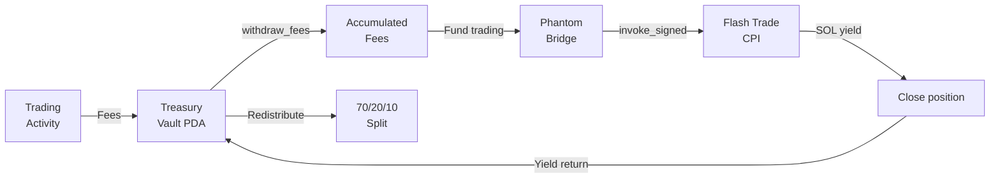

## The Fee Flow

Every RTP-registered token follows the same cycle: trading fees accumulate in the treasury vault, the swarm generates yield, and yield returns for redistribution.



## Platform-Specific Routing

### Pump.fun

Pump.fun creator fees (0.05-0.95%) go to the deployer wallet. RTP uses a keeper to periodically claim and forward:

1. Trader buys/sells → Pump.fun protocol collects fees
2. Creator fee portion → deployer wallet
3. RTP keeper claims from deployer wallet
4. Keeper forwards to treasury vault PDA
5. `withdraw_fees` confirms deposit on-chain

**Gas cost:** ~0.000005 SOL per claim

### Bags.fm

Bags.fm supports multi-claimer fee sharing. The treasury PDA is set directly as a fee claimer:

1. Trader buys/sells → Meteora DLMM collects fees
2. Fee share API splits → 70% treasury PDA, 30% project wallet
3. Fees arrive directly in the vault (no keeper needed)
4. `withdraw_fees` records the deposit

**Gas cost:** None for deposits (platform handles it)

### Raydium LaunchLab

Raydium supports `updatePlatformCpCreator` to redirect all creator fees to a PDA:

1. Trader buys/sells → Raydium AMM collects fees
2. Creator fee portion → treasury PDA (direct redirect)
3. `collectMultiCreatorFees` batches claims
4. `withdraw_fees` records the deposit

**Gas cost:** One-time setup for redirect, then zero per-trade

## Fee Accumulation Cycle

```
1. Fees accumulate in the vault
   └── withdraw_fees() called by keeper/crank

2. Vault balance checked against runway threshold
   └── If > min_runway_balance: redistribute
   └── If < threshold: continue accumulating

3. Redistribution (70/20/10)
   └── check_redistribute() splits the vault balance
   └── SPL transfers to holder/dev/ecosystem ATAs
```

## Yield Generation from Fees

When the vault has sufficient capital:

1. **Commit SOL via CPI** — Treasury PDA commits SOL via invoke_signed → Flash Trade CPI opens position
2. **Execute strategy** — on-chain Flash Trade perps position opened via CPI (Treasury PDA signs)
3. **Collect yield** — SOL returned when position closes via Flash Trade CPI
4. **Return to treasury** — SOL yield deposited back to the treasury PDA (single chain)

The entire cycle is visible on-chain: every CPI instruction, every position open/close, every treasury deposit has a transaction signature.

## Capital Safety

- **SOL throughout** — positions opened with SOL via Flash Trade CPI. No USDC conversion, no cross-chain bridge.
- **Max 20% position size** — no single trade risks more than 20% of treasury reserves
- **Fee-only capital** — the swarm only trades with fee revenue, never with user deposits
- **On-chain execution** — all trading happens on Solana via CPI. Funds never leave the chain.
