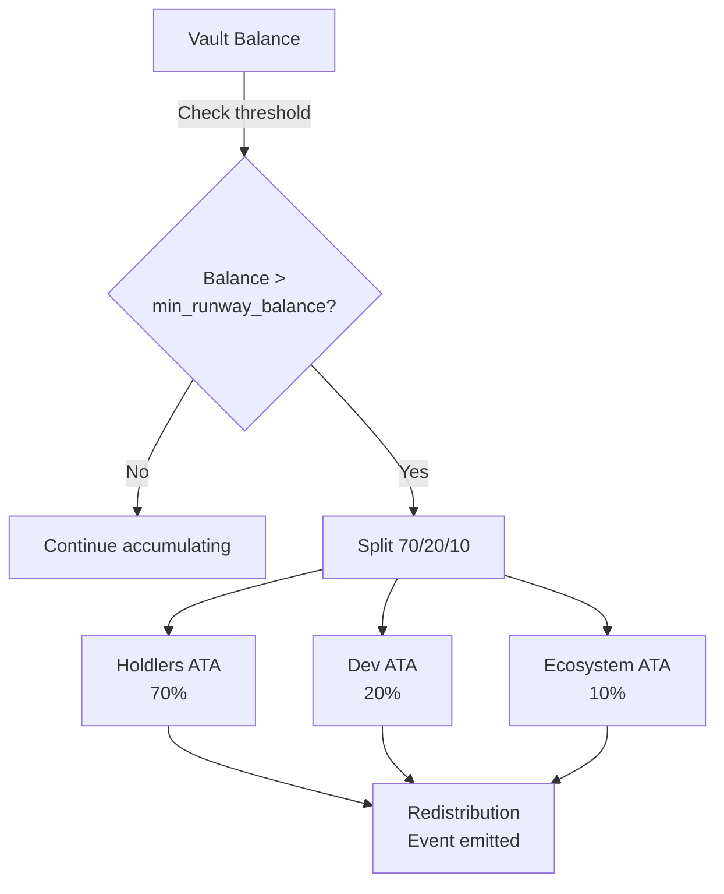

## The 70/20/10 Split

When the treasury vault accumulates enough yield, the on-chain program automatically redistributes funds:

| Recipient | Share | Purpose |
|-----------|-------|---------|
| Holders | 70% | Direct value return to token holders |
| Project Dev | 20% | Sustains project development |
| Ecosystem | 10% | Funds broader ecosystem growth |

## How It Works

The redistribution is triggered by the `check_redistribute` instruction — a **permissionless crank** that anyone can call.



### On-Chain Mechanics

1. **Threshold check** — vault balance must exceed `min_runway_balance`
2. **Calculate splits** — 70%, 20%, 10% of the surplus
3. **SPL transfers** — atomic CPI transfers to each recipient's Associated Token Account
4. **Emit event** — `Redistribution` event logged for auditability
5. **Update counters** — cumulative totals updated with `saturating_add`

### The Crank Pattern

Redistribution uses the **crank pattern** common in Solana programs:

- Anyone can call `check_redistribute` — it's permissionless
- The program enforces all constraints (thresholds, correct splits)
- No authority signature needed — the program is the authority
- Multiple crank calls are idempotent (won't double-distribute)

## Self-Hydration

Before redistribution, the program checks if the swarm needs operational funding:

```
If sustenance bucket > 90-day runway:
  → Redistribute surplus (70/20/10)
Else:
  → Fund swarm operations first
  → Accumulate until runway is healthy
```

This ensures the swarm keeps running before distributing yield. The 90-day runway invariant is enforced on-chain.

## Phase Evolution

As the treasury grows, it evolves through irreversible phases:

| Phase | Trigger | Behavior |
|-------|---------|----------|
| **Sustenance** | Default | Build runway, fund swarm operations |
| **Ecosystem** | Vault > threshold | Auto-invest in top RTP token LPs |
| **Humanity** | Treasury > large threshold | Fund public goods and humanity projects |

Phase transitions are **irreversible** — once the treasury enters Ecosystem, it cannot go back to Sustenance. This is enforced on-chain by the Anchor program.

## Viewing Redistribution Events

Every redistribution emits an on-chain event with full details:

```typescript
// From the SDK
const state = await fetchTreasuryState(connection, mintAddress);
console.log(`Total distributed to holders: ${state.totalDistributedHolders}`);
console.log(`Total distributed to dev: ${state.totalDistributedDev}`);
console.log(`Total distributed to ecosystem: ${state.totalDistributedEcosystem}`);
```

Or view directly on Solana Explorer:
- [View demo redistribution tx (devnet)](https://explorer.solana.com/tx/9HzWgBfwYxs5ModdjF5mT6gdTfayQq8mMYipopyHfGPmYqk6KESHFqgDrc9Mcie573ttcdPqMHSyJP5nNBKK3bR?cluster=devnet)
