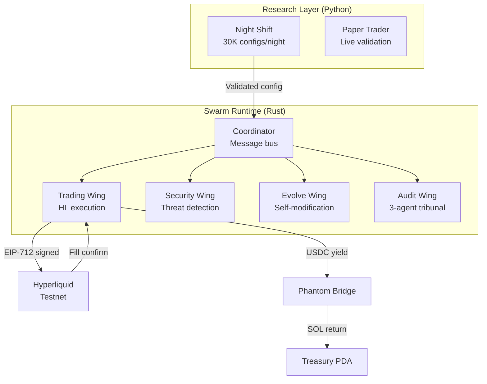

## The Swarm Runtime

RTP's swarm runtime is a Rust-based multi-wing agent system. The Trading Wing is the only wing that touches capital — it executes validated strategies on Hyperliquid.



## Trading Wing

The Trading Wing handles the full execution lifecycle:

1. **Receive strategy** — Coordinator delivers validated config from the research layer
2. **Build order** — Constructs EIP-712 signed order payload for Hyperliquid
3. **Submit** — Sends REST API call to HL testnet (`api.hyperliquid-testnet.xyz`)
4. **Track position** — Monitors fills, computes PnL on close
5. **Return yield** — Bridges USDC profit back to SOL, deposits to treasury PDA

### Signing Architecture

- **HL order signing**: ETH keypair, EIP-712 typed data
- **Solana CPI signing**: Phantom KMS (production) or local keypair (demo)
- **Bridge signing**: Phantom MCP server (agent wallet)

### Position Tracking

The Trading Wing maintains an in-memory position state:

```rust
struct PositionState {
    coin: String,
    direction: Direction, // Long or Short
    entry_price: f64,
    size: f64,
    opened_at: u64,
    unrealized_pnl: Option<f64>,
}
```

When a fill is received, the wing opens or closes the position and computes realized PnL.

## Research Layer

### Night Shift

The Night Shift runs 30,000 parameter combinations per symbol per night through a 9-fold expanding-window walk-forward validation. Surviving candidates are promoted through statistical + regime + consensus checks.

**Top validated strategy (SOL/USDT):**
- Survivor score: 2.69
- OOS Sharpe: +3.96
- Consistency: 100% (9/9 folds profitable)
- Config: signal_threshold=0.3, tp_atr=3.0, sl_atr=1.5, max_hold=36h

### Paper Trader

Live paper trading on Binance validates strategies in real-time before capital deployment. Monitors for degradation with hard stops (10% 24h drawdown, 5 consecutive losses).

## Strategy Lifecycle

| Phase | Gate | Action |
|-------|------|--------|
| Research → Paper Trading | OOS Sharpe ≥ 1.5, 3+ profitable folds | Promote to paper |
| Paper Trading → Live | 72h+ profitable, 2/3 validators approve | Register on-chain |
| Live → Suspended | 10% drawdown, 5 consecutive losses | Hard stop |
| Suspended → Retired | 3 soft strikes (Sharpe decay, regime mismatch) | Permanent retirement |

## Swarm Wings

| Wing | Purpose |
|------|---------|
| **Trading** | Yield generation + Hyperliquid execution |
| **Security** | Threat detection, rate-limiting, suspicious proposal detection |
| **Evolve** | Self-modification, adaptation, rollback |
| **Knowledge** | In-memory knowledge graph, cross-wing queries |
| **Audit** | 3-agent tribunal (Skeptic/UserProxy/Optimizer), Byzantine consensus |
| **Future-proof** | Deprecation monitoring, quantum readiness |

All cross-wing communication goes through the Coordinator via typed, signed messages. Wings never modify each other directly.
