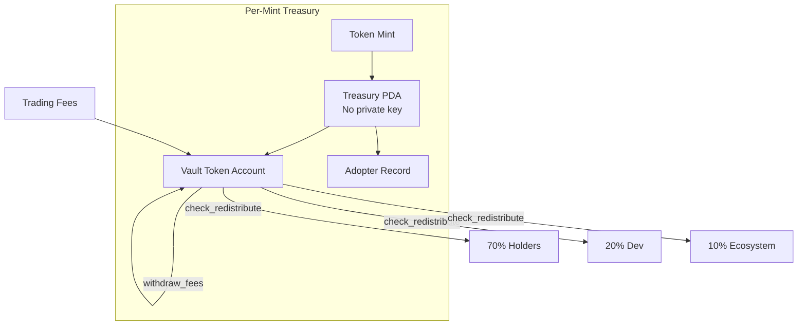

## Per-Mint Treasury Architecture

Every token registered with RTP gets its own treasury — a **program-derived address (PDA)** that owns the vault where fees accumulate. The PDA has no private key; it's controlled exclusively by the on-chain program.



## Key Properties

### PDA Ownership

The treasury is a PDA — it has no associated private key. No one, not even the protocol creators, can sign a transaction "from" the treasury. All fund movements happen through program instructions with hard constraints.

### CPI-Only Transfers

All token movements are Cross-Program Invocation (CPI) calls. The program decides when and how funds move — no external signer can bypass the constraints.

### Per-Mint Isolation

Each token gets its own treasury PDA, vault, and adopter record. Tokens are completely isolated — one token's treasury cannot be affected by another token's activity.

### Deterministic Derivation

Given a mint address, anyone can derive the treasury PDA:

```typescript
import { PublicKey } from "@solana/web3.js";

const RTP_PROGRAM_ID = new PublicKey("8rt6yiBnRTyHy8F69jUd7exWwwShUs4Eokeq41auo2RB");

const [treasuryPDA] = PublicKey.findProgramAddressSync(
  [Buffer.from("treasury"), mint.toBuffer()],
  RTP_PROGRAM_ID,
);
```

## On-Chain State

The treasury account stores:

| Field | Type | Description |
|-------|------|-------------|
| `mint` | PublicKey | The token mint this treasury is for |
| `authority` | PublicKey | Who can call authority-gated instructions |
| `phase` | Enum | Sustenance / Ecosystem / Humanity |
| `holders_wallet` | PublicKey | 70% distribution recipient |
| `project_dev_wallet` | PublicKey | 20% distribution recipient |
| `ecosystem_wallet` | PublicKey | 10% distribution recipient |
| `vault` | PublicKey | Token account holding fees |
| `min_runway_balance` | u64 | Minimum balance before ops funding |
| `total_fees_withdrawn` | u64 | Lifetime fees processed |
| `total_distributed_holders` | u64 | Cumulative holder payouts |
| `total_distributed_dev` | u64 | Cumulative dev payouts |
| `total_distributed_ecosystem` | u64 | Cumulative ecosystem payouts |
| `total_hydration` | u64 | Cumulative swarm funding |

All cumulative counters use `saturating_add` — they never overflow.

## Trust Model

### Authority-Gated Actions

These require the treasury authority's signature:
- `initialize` — creates treasury
- `evolve_phase` — irreversible phase transitions
- `register_strategy` — promotes strategy to Live
- `force_retire_strategy` — emergency retirement
- `end_beta` — ends beta participation

### Permissionless Actions

Anyone can call these — they either move funds INTO the PDA (never out) or record state:
- `withdraw_fees` — pulls fees into vault (not out)
- `check_redistribute` — triggers 70/20/10 split (deterministic)
- `hydrate_swarm` — proposes funding (gated by strategy status)
- `record_fee_deposit` — accounting only

## Program Deployment

| Network | Program ID |
|---------|-----------|
| Devnet | `8rt6yiBnRTyHy8F69jUd7exWwwShUs4Eokeq41auo2RB` |
| Mainnet | TBD (post-hackathon) |

[View demo treasury on Solana Explorer (devnet)](https://explorer.solana.com/address/FNQbK1Vw77aT7qM1EMSmeEPDGizSNhX4rkkYBKQNFotF?cluster=devnet)
