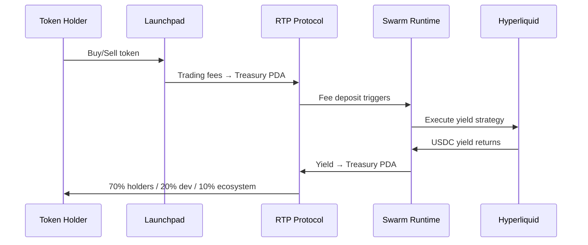

## What is RTP?

RTP (Resilient Token Protocol) is Solana-native, self-funding treasury infrastructure that any launchpad integrates with a single function call. Token trading fees route to a program-owned treasury vault, and an autonomous swarm generates yield — returning it to the project and its holders. Forever.

There is no RTP token. RTP is infrastructure.

### Why This Is Different

- **Constitutional governance** — soulcontract enforced in Rust (soulguard.rs) AND on-chain (Anchor program). No other project has both.
- **Self-funding economics** — treasury generates its own yield via Hyperliquid perps, with irreversible phase evolution (Sustenance → Ecosystem → Humanity).
- **Proven research engine** — 30,000 configs tested per night, 9-fold walk-forward validation, fee-aware simulation.
- **On-chain constraint proof** — the Anchor program deliberately rejects invalid transactions. Constraint rejection IS the demo.
- **Hyperliquid execution** — EIP-712 signed orders from Rust, fills on HL testnet, USDC yield deposited to Solana PDA.

### How It Works



1. **Fees arrive** — trading fees from the token flow to the per-mint treasury vault PDA
2. **Swarm trades** — the autonomous swarm executes validated strategies on Hyperliquid
3. **Yield returns** — generated yield flows back to the treasury PDA
4. **Redistribution** — 70% to holders, 20% to project dev, 10% to ecosystem (enforced on-chain)

### Quick Start

For launchpads looking to integrate RTP:

```bash
npm install @resilient-protocol/sdk @solana/web3.js
```

```typescript
import { registerWithRTP } from "@resilient-protocol/sdk";
import { Connection, PublicKey } from "@solana/web3.js";

const connection = new Connection("https://api.mainnet-beta.solana.com");
const mintAddress = new PublicKey("..."); // your token's mint

const result = await registerWithRTP(connection, wallet, {
  mint: mintAddress,
  platform: "pumpfun", // or "bags" or "raydium"
  name: "My Token",
  symbol: "MTK",
});

// result.treasuryPDA, result.vaultPDA, result.adopterPDA
```

Head to [Getting Started](/docs/getting-started) for the full integration guide.
