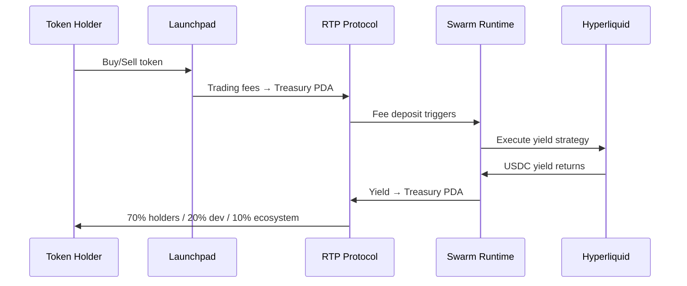

## What is RTP?

RTP (Resilient Token Protocol) gives every token a program-enforced treasury vault on Solana. Trading fees accumulate in the vault, an autonomous swarm generates yield on Hyperliquid, and yield flows back to holders, developers, and ecosystem — 70/20/10 split, enforced on-chain. Forever.

There is no RTP token. RTP is infrastructure.

### Why This Is Different

- **Constitutional governance** — soulcontract enforced in Rust AND on-chain (Anchor program). No one — not even the team — can override the rules.
- **Self-funding economics** — treasury generates its own yield via Hyperliquid perps, with irreversible phase evolution (Sustenance → Ecosystem → Humanity).
- **Proven research engine** — 30,000 configs tested per night, 9-fold walk-forward validation, fee-aware simulation.
- **On-chain constraint proof** — the Anchor program deliberately rejects invalid transactions. Constraint rejection IS the demo.
- **Hyperliquid execution** — EIP-712 signed orders from Rust, fills on HL testnet, USDC yield deposited to Solana PDA.

### How It Works

1. **Fees arrive** — trading fees from the token flow to the per-mint treasury vault PDA
2. **Swarm trades** — the autonomous swarm executes validated strategies on Hyperliquid (USDC-margined, no SOL liquidation risk)
3. **Yield returns** — generated yield flows back to the treasury PDA
4. **Redistribution** — 70% to holders, 20% to project dev, 10% to ecosystem (enforced on-chain)

### Token Creator or Platform?

- **Token creators**: If your launchpad supports RTP, enabling the treasury takes one click. See [Getting Started — Token Creators](/docs/getting-started-creators).
- **Platforms**: Integrate RTP as a feature you offer. See [Getting Started — Platforms](/docs/getting-started-platforms).
