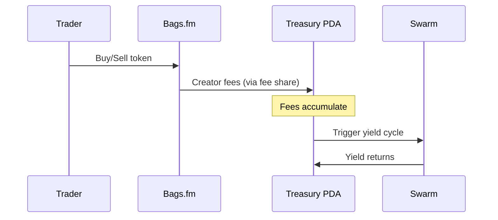

## Overview

Bags.fm is a Solana launch platform that runs on Meteora DLMM pools. Its standout feature for RTP is **multi-claimer fee sharing** — up to 100 fee claimers with custom basis point splits. This makes it the most direct integration: set the RTP treasury PDA as a fee claimer and fees route there automatically.

## How It Works



## Prerequisites

- A Bags.fm API key (get one at [dev.bags.fm](https://dev.bags.fm))
- A Solana wallet with SOL for transactions
- Your token metadata (name, symbol, image)

## Integration Steps

### 1. Create token info

```typescript
const tokenRes = await fetch("https://api.bags.fm/v1/token/create-info", {
  method: "POST",
  headers: {
    "Content-Type": "application/json",
    "x-api-key": BAGS_API_KEY,
  },
  body: JSON.stringify({
    imageUrl: "https://ipfs.io/ipfs/...",
    name: "My Token",
    symbol: "MTK",
    description: "A token with RTP treasury integration",
    website: "https://mytoken.com",
    twitter: "@mytoken",
    telegram: "t.me/mytoken",
  }),
});

const { tokenMint, tokenMetadata } = await tokenRes.json();
```

### 2. Configure fee sharing with RTP treasury

This is where RTP integrates. Set the treasury PDA as a fee claimer:

```typescript
// After registerWithRTP, you have the treasury PDA
const rtpResult = await registerWithRTP(connection, wallet, {
  mint: new PublicKey(tokenMint),
  platform: "bags",
  name: "My Token",
  symbol: "MTK",
});

// Configure Bags.fm fee sharing: 70% to RTP treasury, 30% to project
const configRes = await fetch("https://api.bags.fm/v1/config/create-fee-share", {
  method: "POST",
  headers: {
    "Content-Type": "application/json",
    "x-api-key": BAGS_API_KEY,
  },
  body: JSON.stringify({
    payer: wallet.publicKey.toBase58(),
    baseMint: tokenMint,
    feeClaimers: [
      { user: rtpResult.treasuryPDA, userBps: 7000 },  // 70% to RTP
      { user: wallet.publicKey.toBase58(), userBps: 3000 }, // 30% to project
    ],
  }),
});
```

### 3. Sign and submit fee share transactions

```typescript
const configData = await configRes.json();
for (const txBase64 of configData.transactions || []) {
  const tx = Transaction.from(Buffer.from(txBase64, "base64"));
  const signed = await wallet.signTransaction(tx);
  const raw = signed.serialize();
  await connection.sendRawTransaction(raw);
}
```

### 4. Launch the token

```typescript
const launchRes = await fetch("https://api.bags.fm/v1/token/create-launch-tx", {
  method: "POST",
  headers: {
    "Content-Type": "application/json",
    "x-api-key": BAGS_API_KEY,
  },
  body: JSON.stringify({
    metadataUrl: tokenMetadata,
    tokenMint: tokenMint,
    launchWallet: wallet.publicKey.toBase58(),
    initialBuyLamports: 0.1 * 1_000_000_000, // 0.1 SOL
    configKey: configData.meteoraConfigKey,
  }),
});
```

## Fee Sharing Models

Bags.fm supports 4 fee modes. For RTP integration, we recommend:

| Mode | Pre-Graduation | Post-Graduation | RTP Recommendation |
|------|---------------|-----------------|-------------------|
| Default | 2% | 2% | Best for community tokens |
| Low Pre/High Post | 0.25% | 1% | Good for growth phase |
| High Pre/Low Post | 1% | 0.25% | Good for established tokens |
| High Flat | 10% | 10% | Aggressive fee capture |

The multi-claimer system supports up to 100 fee claimers. A typical RTP setup:

```
Treasury PDA: 7000 bps (70%)  → RTP yield generation
Project Wallet: 2000 bps (20%) → Project development
Team Wallet: 1000 bps (10%)   → Operations
```

## Limitations

- **Mainnet only** — Bags.fm operates on Solana mainnet
- **API key required** — get one at [dev.bags.fm](https://dev.bags.fm)
- **Fee claimers must sum to 10,000 bps** — enforced by the API

## Complete Example

```typescript
import { registerWithRTP } from "@resilient-protocol/sdk";
import { Connection, Transaction, PublicKey } from "@solana/web3.js";

async function launchBagsWithRTP(wallet, apiKey) {
  const connection = new Connection("https://api.mainnet-beta.solana.com");
  const headers = { "Content-Type": "application/json", "x-api-key": apiKey };

  // 1. Create token info
  const tokenRes = await fetch("https://api.bags.fm/v1/token/create-info", {
    method: "POST",
    headers,
    body: JSON.stringify({
      imageUrl: "https://example.com/token.png",
      name: "Community Token",
      symbol: "CMTY",
      description: "Powered by RTP",
    }),
  });
  const { tokenMint, tokenMetadata } = await tokenRes.json();

  // 2. Register with RTP
  const rtpResult = await registerWithRTP(connection, wallet, {
    mint: new PublicKey(tokenMint),
    platform: "bags",
    name: "Community Token",
    symbol: "CMTY",
  });

  // 3. Configure fee sharing (70% RTP, 30% project)
  const configRes = await fetch("https://api.bags.fm/v1/config/create-fee-share", {
    method: "POST",
    headers,
    body: JSON.stringify({
      payer: wallet.publicKey.toBase58(),
      baseMint: tokenMint,
      feeClaimers: [
        { user: rtpResult.treasuryPDA, userBps: 7000 },
        { user: wallet.publicKey.toBase58(), userBps: 3000 },
      ],
    }),
  });
  const configData = await configRes.json();

  // Sign fee share config transactions
  for (const txBase64 of configData.transactions || []) {
    const tx = Transaction.from(Buffer.from(txBase64, "base64"));
    const signed = await wallet.signTransaction(tx);
    await connection.sendRawTransaction(signed.serialize());
  }

  // 4. Launch
  const launchRes = await fetch("https://api.bags.fm/v1/token/create-launch-tx", {
    method: "POST",
    headers,
    body: JSON.stringify({
      metadataUrl: tokenMetadata,
      tokenMint: tokenMint,
      launchWallet: wallet.publicKey.toBase58(),
      initialBuyLamports: 100_000_000,
      configKey: configData.meteoraConfigKey,
    }),
  });
  const launchData = await launchRes.json();
  const launchTx = Transaction.from(Buffer.from(launchData.transaction, "base64"));
  const signedLaunch = await wallet.signTransaction(launchTx);
  const sig = await connection.sendRawTransaction(signedLaunch.serialize());

  return { mint: tokenMint, signature: sig, ...rtpResult };
}
```
