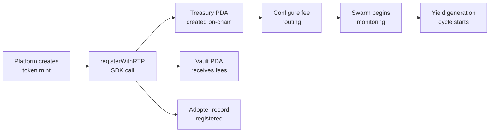

## The Integration Model

RTP is designed as a **post-launch add-on**. Your platform launches tokens however it normally does. After the mint exists, RTP wraps it with treasury infrastructure.



## Fee Routing Patterns

Each platform handles fees differently. RTP adapts to each:

### Direct PDA Routing
The platform sends fees directly to the RTP treasury vault PDA. Best-case scenario — no intermediary.

**Platforms:** Bags.fm (fee share API), Raydium (creator redirect)

### Keeper-Based Claiming
The platform sends fees to the deployer wallet. An RTP keeper service periodically claims and forwards to the treasury PDA.

**Platforms:** Pump.fun (creator fees to deployer)

## MPC Server (Managed Service)

For launchpads that prefer not to run chain operations themselves, RTP provides an MPC (Multi-Party Computation) server that handles all on-chain interactions:

```
Launchpad ──POST /v1/adopt──▸ RTP MPC Server ──▸ Solana
                              │
                              ├── Derives treasury PDA
                              ├── Initializes treasury
                              ├── Registers adopter
                              └── Configures fee routing
```

See the [MPC API Reference](/docs/integration/mpc-api) for the full endpoint documentation.

## Platform Selection Guide

| Platform | Best For | Fee Model | Dev Cost |
|----------|----------|-----------|----------|
| [Pump.fun](/docs/integration/pump-fun) | Memecoins, community tokens | Creator fees (0.05-0.95%) | Low |
| [Bags.fm](/docs/integration/bags-fm) | Creator-focused tokens, fee sharing | Multi-claimer fee split (0.125-5%) | Low |
| [Raydium](/docs/integration/raydium) | DeFi tokens, AMM LP bootstrap | Configurable creator fees (0.25%+) | Medium |

## Integration Checklist

- [ ] Install `@resilient-protocol/sdk`
- [ ] Call `registerWithRTP()` after token creation
- [ ] Configure platform-specific fee routing
- [ ] Display treasury state to users (optional)
- [ ] Test on devnet before mainnet deployment
