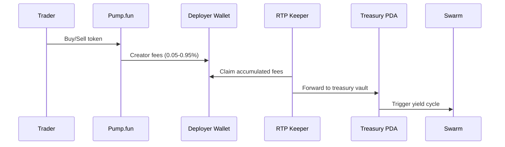

## Overview

Pump.fun is the highest-volume memecoin launchpad on Solana. Creator fees (0.05-0.95% dynamic) go to the token deployer's wallet. RTP integrates via a keeper that periodically claims these fees and forwards them to the treasury PDA.

## How It Works



## Prerequisites

- A Solana wallet with SOL for transaction fees
- Your token already deployed on Pump.fun
- The token's mint address

## Integration Steps

### 1. Launch via PumpPortal API

RTP's launch page uses the PumpPortal API to create tokens programmatically:

```typescript
// Build the create transaction via PumpPortal
const response = await fetch("https://pumpportal.fun/api/trade-local", {
  method: "POST",
  headers: { "Content-Type": "application/json" },
  body: JSON.stringify({
    publicKey: wallet.publicKey.toBase58(),
    action: "create",
    tokenMetadata: {
      name: "My Token",
      symbol: "MTK",
      uri: "https://ipfs.io/ipfs/...", // metadata URI
    },
    mint: mintKeypair.publicKey.toBase58(),
    denominatedInSol: "true",
    amount: 0.1, // dev buy amount in SOL
    slippage: 10,
    priorityFee: 0.00005,
    pool: "pump",
  }),
});

// Deserialize and sign
const txData = await response.arrayBuffer();
const tx = VersionedTransaction.deserialize(new Uint8Array(txData));
tx.sign([mintKeypair]);
const signedTx = await wallet.signTransaction(tx);
```

### 2. Register with RTP

After the token is live on Pump.fun, register it with RTP:

```typescript
import { registerWithRTP } from "@resilient-protocol/sdk";

const result = await registerWithRTP(connection, wallet, {
  mint: new PublicKey(mintAddress),
  platform: "pumpfun",
  name: "My Token",
  symbol: "MTK",
});
```

### 3. Fee Claiming

Pump.fun sends creator fees to the deployer wallet. RTP provides a keeper service that:

1. Monitors the deployer wallet for accumulated creator fees
2. Periodically withdraws fees via Pump.fun's `claimCreatorFee` instruction
3. Forwards claimed fees to the RTP treasury vault PDA
4. Triggers `check_redistribute` if the vault balance exceeds the threshold

The keeper runs automatically: no action needed from the launchpad.

## Fee Structure

| Market Cap | Creator Fee | Protocol Fee | Total |
|-----------|-------------|-------------|-------|
| < $100K | 0.95% | 1.25% | 2.20% |
| $100K - $1M | 0.50% | 1.00% | 1.50% |
| > $1M | 0.05% | 0.30% | 0.35% |

Creator fees are dynamic based on market cap. The RTP keeper accounts for this when calculating expected fee revenue.

## Limitations

- **No direct PDA routing:** Pump.fun sends fees to the deployer wallet, not an arbitrary PDA
- **Mainnet only:** Pump.fun operates on Solana mainnet, no devnet support
- **No API key required:** PumpPortal is a public API (rate limits apply)

## Example: Full Launch + RTP Registration

```typescript
import { registerWithRTP } from "@resilient-protocol/sdk";
import { Connection, Keypair, VersionedTransaction } from "@solana/web3.js";

async function launchWithRTP(wallet) {
  const connection = new Connection("https://api.mainnet-beta.solana.com");
  const mintKeypair = Keypair.generate();

  // Step 1: Create token on Pump.fun
  const res = await fetch("https://pumpportal.fun/api/trade-local", {
    method: "POST",
    headers: { "Content-Type": "application/json" },
    body: JSON.stringify({
      publicKey: wallet.publicKey.toBase58(),
      action: "create",
      tokenMetadata: {
        name: "Community Token",
        symbol: "CMTY",
        uri: "https://example.com/metadata.json",
      },
      mint: mintKeypair.publicKey.toBase58(),
      denominatedInSol: "true",
      amount: 0.1,
      slippage: 10,
      priorityFee: 0.00005,
      pool: "pump",
    }),
  });

  const txData = await res.arrayBuffer();
  const tx = VersionedTransaction.deserialize(new Uint8Array(txData));
  tx.sign([mintKeypair]);
  const signedTx = await wallet.signTransaction(tx);
  const raw = signedTx.serialize();
  const sig = await connection.sendRawTransaction(raw, { skipPreflight: false });
  await connection.confirmTransaction(sig, "confirmed");

  // Step 2: Register with RTP
  const rtpResult = await registerWithRTP(connection, wallet, {
    mint: mintKeypair.publicKey,
    platform: "pumpfun",
    name: "Community Token",
    symbol: "CMTY",
  });

  return { mint: mintKeypair.publicKey.toBase58(), ...rtpResult };
}
```
