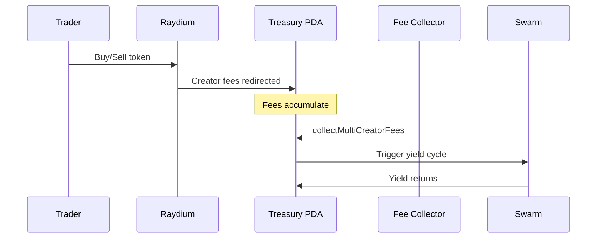

## Overview

Raydium is the #1 DEX/AMM on Solana by TVL. LaunchLab is its token launch vehicle with bonding curve + CPMM migration. Raydium explicitly supports PDA-based fee collection — the best architectural fit for RTP.

## Why Raydium

- **Explicit PDA fee collection** — documented and recommended by Raydium
- `updatePlatformCpCreator` redirects all creator fees to a PDA
- `collectMultiCreatorFees` for batch collection
- **Devnet support** with sUSDC as quote token
- **Full TypeScript SDK** (`@raydium-io/raydium-sdk-v2`)
- **Largest DEX** — tokens launched here get maximum liquidity access

## How It Works



## Prerequisites

- `@raydium-io/raydium-sdk-v2` installed
- A Phantom wallet with SOL for transactions
- Raydium platform registration (for custom fee routing)

## Installation

```bash
npm install @raydium-io/raydium-sdk-v2 @resilient-protocol/sdk
```

## Integration Steps

### 1. Create a LaunchLab token

```typescript
import { Raydium } from "@raydium-io/raydium-sdk-v2";

const raydium = await Raydium.load({ connection, owner: wallet });

const { execute, extInfo } = await raydium.launchpad.createLaunchpad({
  programId: RAYDIUM_LAUNCHLAB_PROGRAM_ID,
  mintA: { mint: NATIVE_MINT, decimals: 9 }, // SOL
  mintB: { mint: tokenMint, decimals: 6 },   // Your token
  name: "My Token",
  symbol: "MTK",
  curveType: "exponential",
  config: {
    lpFundBps: 5000,      // 50% to LP
    creatorFundBps: 250,   // 2.5% creator fees
    protocolFundBps: 250,  // 2.5% protocol fees
  },
});
```

### 2. Register with RTP

```typescript
import { registerWithRTP } from "@resilient-protocol/sdk";

const rtpResult = await registerWithRTP(connection, wallet, {
  mint: tokenMint,
  platform: "raydium",
  name: "My Token",
  symbol: "MTK",
});
```

### 3. Redirect creator fees to treasury PDA

After the token graduates to CPMM, redirect all creator fees to the RTP treasury PDA:

```typescript
// Set the treasury PDA as the platform creator fee recipient
await raydium.launchpad.updatePlatformCpCreator({
  poolId: graduatedPoolId,
  newCreator: new PublicKey(rtpResult.treasuryPDA),
});
```

After this call, all creator fees from trading activity flow directly to the RTP treasury vault. No intermediary, no keeper needed.

### 4. Batch fee collection (keeper/optional)

For graduated tokens, periodically collect accumulated fees:

```typescript
const fees = await raydium.launchpad.collectMultiCreatorFees({
  owner: wallet.publicKey,
  poolIds: [graduatedPoolId],
});
```

## Fee Structure

| Stage | Creator Fee | Protocol Fee | LP Fee | Community |
|-------|------------|-------------|--------|-----------|
| Bonding curve | 0.25% | 0.25% | — | 0.25% |
| Post-migration (CPMM) | Configurable | 0.25% | Dynamic | — |

Creator fees are collected in the pool's base token (typically SOL). The RTP treasury receives SOL directly.

## Devnet Testing

Raydium supports devnet with sUSDC as the quote token:

```typescript
const connection = new Connection("https://api.devnet.solana.com");
// Use sUSDC (devnet stablecoin) instead of SOL for devnet launches
```

This is the only platform in the RTP lineup that supports devnet testing of the full fee-routing flow.

## Complete Example

```typescript
import { registerWithRTP } from "@resilient-protocol/sdk";
import { Raydium } from "@raydium-io/raydium-sdk-v2";
import { Connection, Keypair, NATIVE_MINT, PublicKey } from "@solana/web3.js";

async function launchRaydiumWithRTP(wallet) {
  const connection = new Connection("https://api.mainnet-beta.solana.com");
  const tokenMint = Keypair.generate().publicKey; // your token mint

  // 1. Create LaunchLab token
  const raydium = await Raydium.load({ connection, owner: wallet });
  const { execute } = await raydium.launchpad.createLaunchpad({
    programId: RAYDIUM_LAUNCHLAB_PROGRAM_ID,
    mintA: { mint: NATIVE_MINT, decimals: 9 },
    mintB: { mint: tokenMint, decimals: 6 },
    name: "Community Token",
    symbol: "CMTY",
    curveType: "exponential",
    config: {
      lpFundBps: 5000,
      creatorFundBps: 250,
      protocolFundBps: 250,
    },
  });
  const launchResult = await execute({ sendAndConfirm: true });

  // 2. Register with RTP
  const rtpResult = await registerWithRTP(connection, wallet, {
    mint: tokenMint,
    platform: "raydium",
    name: "Community Token",
    symbol: "CMTY",
  });

  // 3. After graduation: redirect creator fees to RTP treasury
  // (This would happen after the bonding curve completes)
  // await raydium.launchpad.updatePlatformCpCreator({
  //   poolId: launchResult.poolId,
  //   newCreator: new PublicKey(rtpResult.treasuryPDA),
  // });

  return { mint: tokenMint.toBase58(), ...rtpResult };
}
```

## Limitations

- **Creator fee redirect requires graduation** — bonding curve phase uses a different fee mechanism
- **Platform registration** may be needed for custom creator fee configuration
- **SDK is large** — `@raydium-io/raydium-sdk-v2` adds significant bundle size
