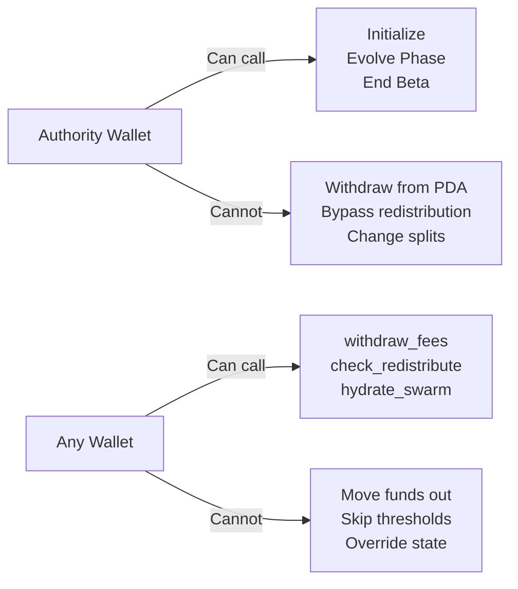

## Multi-Layer Security

RTP enforces security at four layers, each independent and complementary:

| Layer | Mechanism | Scope |
|-------|-----------|-------|
| **On-chain** | Anchor program constraints, PDA authority checks | All fund movements |
| **Runtime** | soulguard.rs validates every message against invariants | All swarm operations |
| **Execution** | Trading Wing enforces position limits before HL API calls | Capital deployment |
| **Governance** | soulcontract.md — constitutional invariants | All protocol changes |

## On-Chain Invariants

These are enforced by the Anchor program and cannot be bypassed:

1. **PDA owns treasury** — no private key can sign funds away
2. **CPI-only transfers** — all movements are atomic, verifiable, program-controlled
3. **Phase transitions irreversible** — Sustenance → Ecosystem → Humanity, no downgrade
4. **Self-hydration gated** — ops funding only if sustenance > 90-day runway
5. **Cumulative counters saturate** — `saturating_add` prevents overflow to wrong values

## PDA Ownership

The treasury is a Program-Derived Address:

- **No private key exists** — even if someone compromises the authority wallet, they cannot sign from the PDA
- **Program is the signer** — the Anchor program signs for PDA operations via CPI
- **Deterministic** — anyone can verify the PDA derivation from the mint address

## Soulcontract Governance

The soulcontract (`SOULCONTRACT.md`) defines immutable governance invariants enforced at the runtime level:

- **No SOL liquidation** — SOL reserves are never sold. The Phantom bridge handles SOL↔USDC trustlessly.
- **Max 20% position size** — no single trade risks more than 20% of treasury reserves
- **Agent proposes, human approves** — irreversible actions require explicit human sign-off
- **Auto-rollback on degradation** — if performance drops > 5% post-amendment, automatic revert
- **Amendments require 24h monitoring** — no instant self-modification of governance

## Trust Model

### Permissionless Recording

Anyone can:
- `withdraw_fees` — moves funds INTO the PDA (never out)
- `check_redistribute` — triggers deterministic split (no discretion)
- `record_fee_deposit` — accounting only (no fund movement)
- `hydrate_swarm` — proposes funding (gated by Live strategy + runway check)

### Authority-Gated Actions

Only the treasury authority can:
- `initialize` — creates the treasury
- `evolve_phase` — irreversible phase transition
- `register_strategy` — promotes strategy to Live
- `force_retire_strategy` — emergency retirement
- `end_beta` — ends beta participation

### Why This Is Safe

Permissionless instructions either move funds INTO the PDA (never out), record accounting state (no fund movement), or write metrics where enforcement happens via authority-gated on-chain checks.

## Known Considerations

| Item | Status | Mitigation |
|------|--------|-----------|
| Phase thresholds use raw vault balance, not oracle-denominated USD | Accepted for launch | Authority manually verifies before calling `evolve_phase`. Post-launch: integrate Pyth/Switchboard oracle. |
| `check_redistribute` emits event for auditability | Implemented | All redistribution events are queryable on-chain. |
| Strategy performance metrics are updatable by anyone | Accepted | Enforcement is on-chain via `hydrate_swarm` gate — only Live strategies receive funding. |

## Audit Trail

Every significant action produces an on-chain signature or event:

- Treasury initialization → transaction signature
- Fee deposits → `record_fee_deposit` counter updates
- Withdrawals → `withdraw_fees` signature
- Redistribution → `Redistribution` event with amounts
- Phase transitions → `evolve_phase` signature
- Yield deposits → SPL transfer to treasury PDA

Full audit history is queryable via Solana Explorer or the SDK's `fetchTreasuryState()`.

[Read the full security audit](https://github.com/tradewife/resilient-token-protocol/blob/main/docs/SECURITY_AUDIT_2026-04-07.md)
