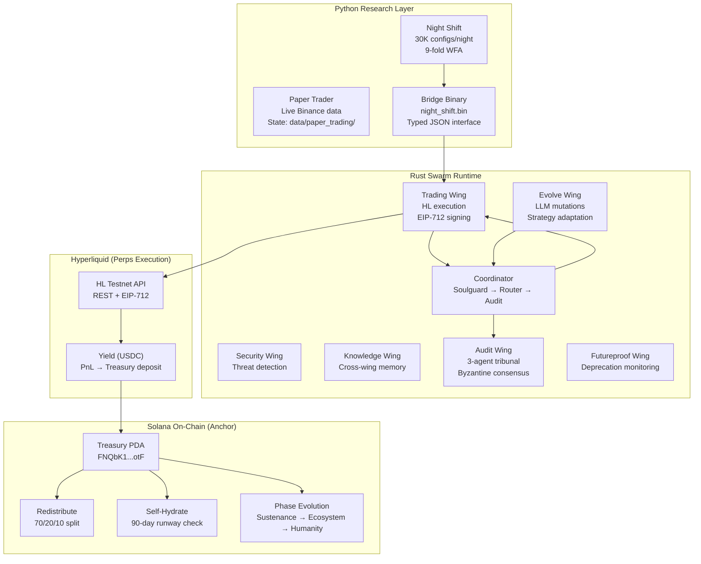

# RTP Architecture

## Three-Layer Stack



## Data Flow

```
[Python Night Shift]                    [Rust Swarm]                    [Solana Devnet]
     │                                       │                                │
     ├── 30K config grid search              │                                │
     ├── 9-fold walk-forward analysis        │                                │
     ├── Darwinian mutations                 │                                │
     │                                       │                                │
     └── bridge.rs ──typed JSON──►  Trading Wing                           │
                                       │                                    │
                                  Soulguard check                          │
                                       │                                    │
                                  Audit tribunal                           │
                                  (Skeptic/UserProxy/Optimizer)            │
                                       │                                    │
                                  ExecutePermit ──►  Hyperliquid POST      │
                                       │            (EIP-712 signed)       │
                                       │                    │               │
                                       │              Fill confirmed        │
                                       │                    │               │
                                       │              YieldReport ◄────────┘
                                       │                    │
                                  Memory persist       Treasury CPI transfer
                                  (data/swarm-memory/)  (USDC yield → SOL → PDA)
```

## Capital Flow (Unified SOL Cycle)

```
SOL in (fees) → Phantom bridge → USDC → HL perps → USDC yield → Phantom bridge → SOL → Treasury PDA
                 (mainnet)        ↑                    ↓           (mainnet)
                              HL clearinghouse    USDC-margined
                              holds working cap   perps positions

Devnet: HL funded directly via faucet. devnet_fund_stub() simulates bridge for demo.
```

## Autonomous Devnet Loop

```
GitHub Actions (cron: every 6h)
  │
  ├── cargo run --bin rtp-daemon
  │     │
  │     ├── Load config from data/devnet-cycles/latest/config.json
  │     ├── Run orchestrator cycle (healthy/declining/stagnant states)
  │     ├── Propose strategy mutations (LLM or deterministic fallback)
  │     ├── Validate against soulcontract bounds
  │     ├── Persist memory to data/swarm-memory/
  │     └── Write cycle output to data/devnet-cycles/YYYY-MM-DDTHH/
  │
  ├── git add data/devnet-cycles/
  └── git commit + push
```
